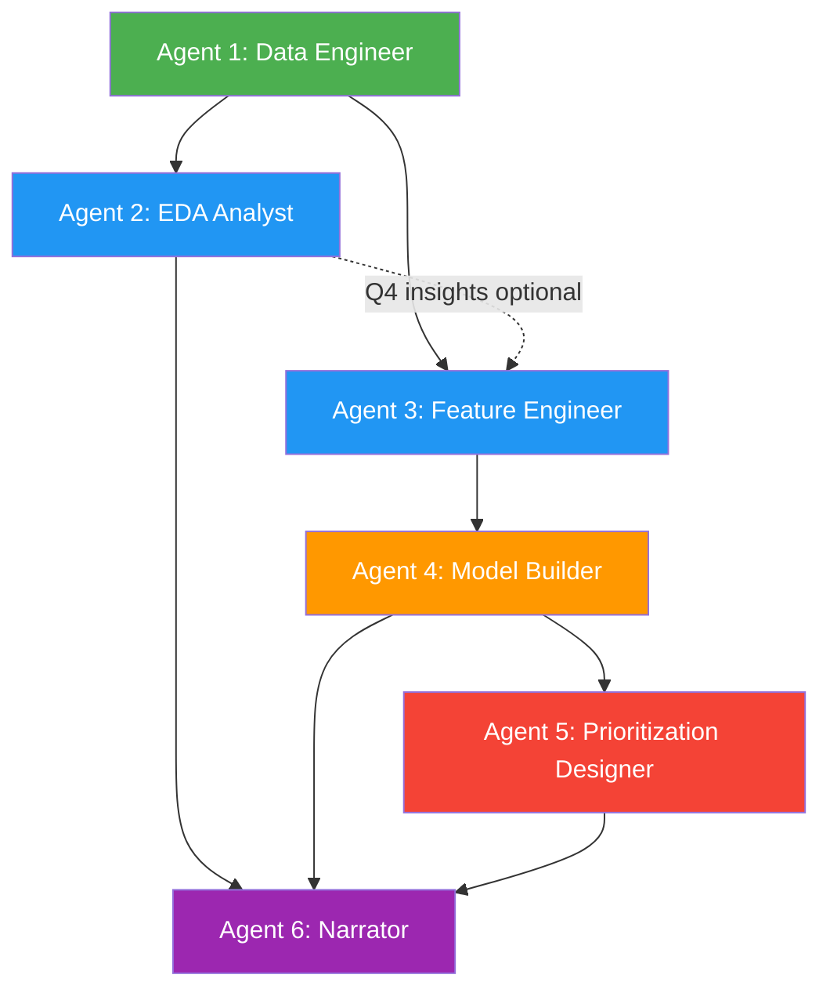

# Dependency Graph



## Execution Order

```
Phase 0: [Bootstrap]         --> Human Checkpoint
Phase 1: [Agent 1]           --> Quality Gate 1 --> Human Checkpoint
Phase 2: [Agent 2 || Agent 3] --> Quality Gate 2 --> Human Checkpoint
Phase 3: [Agent 4]           --> Quality Gate 3 --> Human Checkpoint
Phase 4: [Agent 5]           --> Quality Gate 4
Phase 5: [Agent 6]           --> Quality Gate 5 --> Final Review
```

## Key Dependencies

| Agent | Depends On | Produces For |
|-------|-----------|--------------|
| 1 - Data Engineer | Nothing | All agents (raw data) |
| 2 - EDA Analyst | Agent 1 (raw data) | Agent 6 (findings) |
| 3 - Feature Engineer | Agent 1 (raw data) | Agent 4 (features) |
| 4 - Model Builder | Agent 3 (features) | Agent 5 (predictions), Agent 6 |
| 5 - Prioritization | Agent 4 (predictions) | Agent 6 (results) |
| 6 - Narrator | All agents | Final deliverables |

## Parallelism Opportunities

1. **Agents 2 & 3** run simultaneously after Phase 1
2. **Agent 6** can start notebook 1 polish after Agent 2 finishes, even if Agent 5 is still running
3. **Agent 4** can start as soon as Agent 3 finishes, regardless of Agent 2 status
